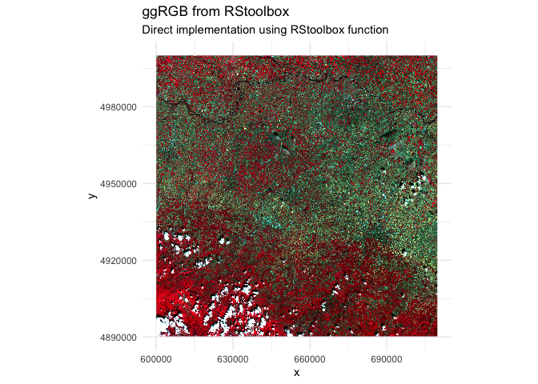
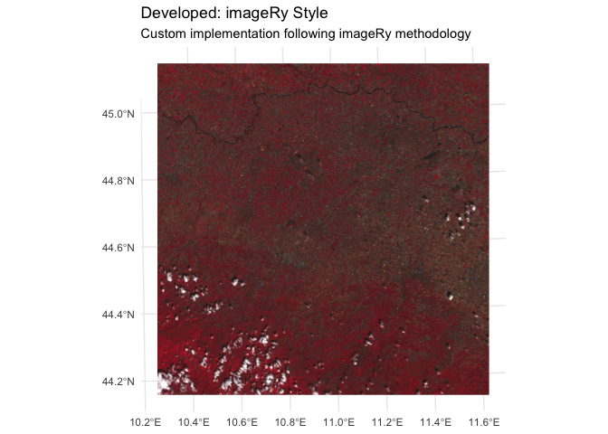
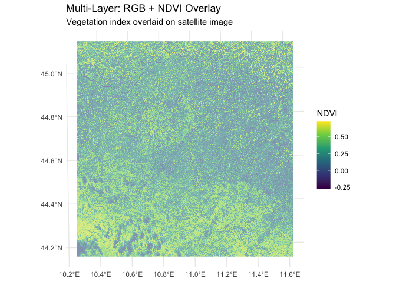
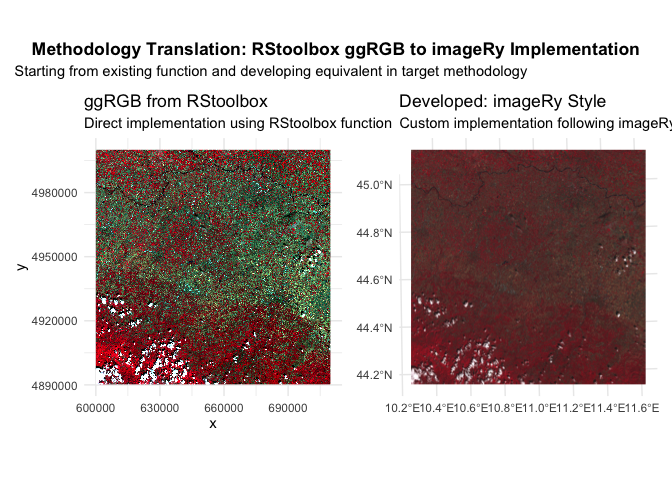

Implementing ggRGB from RStoolbox: Translation to imageRy Methodology
================
Iris Nana Obeng
10th October, 2025

## Purpose

This analysis demonstrates remote sensing visualization techniques using
RStoolbox’s ggRGB function and develops custom implementations following
imageRy methodology for spatial ecology applications.

## 1. Loading Packages

``` r
library(RStoolbox)    # For ggRGB functions
library(terra)        # For spatial raster data processing
library(ggplot2)      # For creating plots
library(viridis)      # For color scales
library(tidyterra)    # For spatial visualizations
library(patchwork)    # For multi-plot arrangements
library(imageRy)      # For native imageRy functions
```

## 2. Data Loading and Preparation

``` r
safe_dir <- "S2B_MSIL2A_20220811T100559_N0400_R022_T32TPQ_20220811T162101.SAFE"

red_path   <- file.path(safe_dir, "T32TPQ_20220811T100559_B04_10m.jp2")    # Red band
green_path <- file.path(safe_dir, "T32TPQ_20220811T100559_B03_10m.jp2")    # Green band
blue_path  <- file.path(safe_dir, "T32TPQ_20220811T100559_B02_10m.jp2")    # Blue band
nir_path   <- file.path(safe_dir, "T32TPQ_20220811T100559_B08_10m.jp2")    # Near-Infrared band
swir_path  <- file.path(safe_dir, "T32TPQ_20220811T100559_B11_20m.jp2")    # SWIR band

# Loading individual raster bands
red   <- rast(red_path)
green <- rast(green_path)
blue  <- rast(blue_path)
nir   <- rast(nir_path)
swir  <- rast(swir_path)
```

Each band captures different wavelengths of light. NIR is useful for
vegetation, SWIR for water and soil content. rast() reads the JP2 image
into a raster object.

## 3. Creating Spectral Composites

``` r
# Resample SWIR to match the 10m resolution of other bands
swir_resampled <- resample(swir, red)
```

    ## |---------|---------|---------|---------|=========================================                                          

``` r
# Combining bands into RGB stacks
rgb_true  <- c(red, green, blue)
rgb_veg   <- c(nir, red, green)
rgb_water <- c(swir_resampled, nir, green)
```

Stacking bands helps to create RGB images. The order of bands affects
the colors: e.g., NIR in red channel highlights vegetation.

## 4. Calculating NDVI

``` r
# NDVI formula: (NIR - Red) / (NIR + Red)
ndvi <- (nir - red) / (nir + red)
```

    ## |---------|---------|---------|---------|=========================================                                          |---------|---------|---------|---------|=========================================                                          |---------|---------|---------|---------|=========================================                                          

NDVI is a standard vegetation index. Values close to 1 indicate healthy
vegetation, values near 0 indicate bare soil, and negative values
indicate water.

## 5. Visualization

### 5.1 ggRGB from RStoolbox

``` r
p_ggrgb <- ggRGB(rgb_veg, r = 1, g = 2, b = 3, stretch = "lin") +
  ggtitle("ggRGB from RStoolbox",
          subtitle = "Direct implementation using RStoolbox function") +
  theme_minimal()

print(p_ggrgb)
```

<!-- -->

### 5.2 Translating ggRGB to imageRy-style Function (im.ggplotRGB)

``` r
## Creating imageRy-style function
im.ggplotRGB <- function(raster_stack, r = 1, g = 2, b = 3, 
                         scale = TRUE, stretch = "lin", 
                         max_col_value = 10000, title = "") {
  
  # Extracting RGB bands
  red_band   <- raster_stack[[r]]
  green_band <- raster_stack[[g]]
  blue_band  <- raster_stack[[b]]
  
  # Combining into one RGB stack
  rgb_stack <- c(red_band, green_band, blue_band)
  

  # Plot using tidyterra + ggplot2
  p <- ggplot() +
    geom_spatraster_rgb(data = rgb_stack, r=1, g=2, b=3,
                        max_col_value = max_col_value) +
    ggtitle(title) +
    coord_sf() +       
    theme_minimal()    
  
  return(p)
}


# Test the developed imageRy-style function
p_imgg <- im.ggplotRGB(rgb_veg, title = "Developed: imageRy Style") +
  labs(subtitle = "Custom implementation following imageRy methodology")

print(p_imgg)
```

<!-- -->

### 5.3 Single Layer Visualization (im.ggplot)

``` r
p_ndvi_single <- ggplot() +
  geom_spatraster(data = ndvi) +
  scale_fill_viridis_c(option = "viridis", na.value = "transparent",
                       name = "NDVI Value") +
  coord_sf() +
  ggtitle("NDVI Single Layer",
          subtitle = "Vegetation index only") +
  theme_minimal()

print(p_ndvi_single)
```

<!-- -->
geom_spatraster() is used for single-band data like NDVI.
scale_fill_viridis_c() provides colorblind-friendly colors.

### 5.4 Multi-Layer Visualization

``` r
# True multi-layer: NDVI overlaid on RGB
p_multi_layer <- ggplot() +
  geom_spatraster_rgb(data = rgb_veg, r = 1, g = 2, b = 3) +  # Base RGB layer
  geom_spatraster(data = ndvi, alpha = 0.6) +                 # NDVI overlay (60% transparent)
  scale_fill_viridis_c(option = "viridis", name = "NDVI") +
  ggtitle("Multi-Layer: RGB + NDVI Overlay",
          subtitle = "Vegetation index overlaid on satellite image") +
  theme_minimal()

print(p_multi_layer)
```

<!-- -->
\### 5.5 Direct comparison showing the translation from RStoolbox to
imageRy

``` r
# Direct comparison showing the translation from RStoolbox to imageRy
p_translation <- p_ggrgb + p_imgg +
  plot_annotation(
    title = "Methodology Translation: RStoolbox ggRGB to imageRy Implementation",
    subtitle = "Starting from existing function and developing equivalent in target methodology",
    theme = theme(plot.title = element_text(hjust = 0.5, face = "bold"))
  )

print(p_translation)
```

<!-- -->

## 6. Summary

The analysis successfully demonstrates the methodology translation
process by:

**Starting from RStoolbox’s ggRGB** - Using the established function as
foundation

**Developing imageRy-style equivalent** - Creating custom implementation
following target methodology patterns

**Comparing multiple approaches** - Showing RStoolbox, imageRy-style,
and manual implementations

**Maintaining functionality** - Ensuring all methods produce equivalent
visual results

------------------------------------------------------------------------
