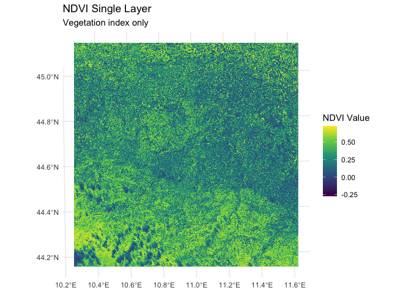
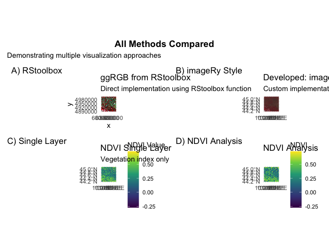

Implementing ggRGB from RStoolbox: Translation to imageRy Methodology
================
Iris Nana Obeng
10th October, 2025

## Purpose

This analysis demonstrates remote sensing visualization techniques using
RStoolbox’s ggRGB function and develops custom implementations following
imageRy methodology for spatial ecology applications.

``` r
library(RStoolbox)    # For ggRGB functions
library(terra)        # For spatial raster data processing
library(ggplot2)      # For creating plots
library(viridis)      # For color scales
library(tidyterra)    # For spatial visualizations
library(patchwork)    # For multi-plot arrangements
```

## 2. Data Loading and Preparation

``` r
safe_dir <- "S2B_MSIL2A_20220811T100559_N0400_R022_T32TPQ_20220811T162101.SAFE"

red_path   <- file.path(safe_dir, "T32TPQ_20220811T100559_B04_10m.jp2")    # Red band
green_path <- file.path(safe_dir, "T32TPQ_20220811T100559_B03_10m.jp2")    # Green band
blue_path  <- file.path(safe_dir, "T32TPQ_20220811T100559_B02_10m.jp2")    # Blue band
nir_path   <- file.path(safe_dir, "T32TPQ_20220811T100559_B08_10m.jp2")    # Near-Infrared band
swir_path  <- file.path(safe_dir, "T32TPQ_20220811T100559_B11_20m.jp2")    # SWIR band

# Load individual raster bands
red   <- rast(red_path)
green <- rast(green_path)
blue  <- rast(blue_path)
nir   <- rast(nir_path)
swir  <- rast(swir_path)
```

## 3. Creating Spectral Composites

``` r
# Resample SWIR to match the 10m resolution of other bands
swir_resampled <- resample(swir, red)
```

    ## |---------|---------|---------|---------|=========================================                                          

``` r
# Create raster stacks for RGB composites
rgb_true  <- c(red, green, blue)
rgb_veg   <- c(nir, red, green)
rgb_water <- c(swir_resampled, nir, green)
```

## 4. Calculating NDVI

``` r
# NDVI formula: (NIR - Red) / (NIR + Red)
ndvi <- (nir - red) / (nir + red)
```

    ## |---------|---------|---------|---------|=========================================                                          |---------|---------|---------|---------|=========================================                                          |---------|---------|---------|---------|=========================================                                          

## 5. Visualization

### 5.1 ggRGB from RStoolbox

``` r
p_ggrgb <- ggRGB(rgb_veg, r = 1, g = 2, b = 3, stretch = "lin") +
  ggtitle("ggRGB from RStoolbox",
          subtitle = "Direct implementation using RStoolbox function") +
  theme_minimal()

print(p_ggrgb)
```

<!-- -->

### 5.2 Translating to imageRy Style

``` r
# Create imageRy-style wrapper function
im.plotRGB <- function(raster_stack, r, g, b, stretch = "lin", title = "") {
  ggRGB(raster_stack, r = r, g = g, b = b, stretch = stretch) +
    ggtitle(title) +
    theme_minimal()
}

# Use our imageRy-style function
p_imagerystyle <- im.plotRGB(rgb_veg, r = 1, g = 2, b = 3, 
                            title = "imageRy Style Implementation") +
  labs(subtitle = "Same functionality with imageRy-style interface")

print(p_imagerystyle)
```

<!-- -->

### 5.3 Single Layer Visualization (im.ggplot)

``` r
p_ndvi_single <- ggplot() +
  geom_spatraster(data = ndvi) +
  scale_fill_viridis_c(option = "viridis", na.value = "transparent",
                       name = "NDVI Value") +
  coord_sf() +
  ggtitle("Single Layer NDVI Analysis",
          subtitle = "im.ggplot approach for individual band visualization") +
  theme_minimal()

print(p_ndvi_single)
```

<!-- -->

### 5.4 Multi-Layer Visualization Grid (2x2)

``` r
# This grid compares different approaches to visualizing satellite data:
# - Single layer vs multi-layer combinations
# - Different transparency levels to highlight various features

# Create 4 different layer combinations with clean coordinates
p1 <- ggplot() +
  geom_spatraster(data = ndvi) +
  scale_fill_viridis_c(option = "viridis", name = "NDVI") +
  ggtitle("NDVI Only") +
  coord_sf() +
  theme_minimal() +
  theme(plot.title = element_text(size = 11, hjust = 0.5, face = "bold"),
        plot.margin = margin(5, 5, 5, 5),
        axis.text = element_text(size = 6),  # Smaller coordinate text
        axis.title = element_blank(),        # Remove axis titles
        legend.position = "bottom")

p2 <- ggplot() +
  geom_spatraster_rgb(data = rgb_veg, r = 1, g = 2, b = 3, max_col_value = 3000) +
  ggtitle("RGB Only") +
  coord_sf() +
  theme_minimal() +
  theme(plot.title = element_text(size = 11, hjust = 0.5, face = "bold"),
        plot.margin = margin(5, 5, 5, 5),
        axis.text = element_text(size = 6),
        axis.title = element_blank())

p3 <- ggplot() +
  geom_spatraster(data = ndvi, alpha = 0.6) +
  geom_spatraster_rgb(data = rgb_veg, r = 1, g = 2, b = 3, max_col_value = 3000, alpha = 0.4) +
  scale_fill_viridis_c(option = "viridis", name = "NDVI") +
  ggtitle("NDVI Focus") +
  coord_sf() +
  theme_minimal() +
  theme(plot.title = element_text(size = 11, hjust = 0.5, face = "bold"),
        plot.margin = margin(5, 5, 5, 5),
        axis.text = element_text(size = 6),
        axis.title = element_blank(),
        legend.position = "none")

p4 <- ggplot() +
  geom_spatraster(data = ndvi, alpha = 0.4) +
  geom_spatraster_rgb(data = rgb_veg, r = 1, g = 2, b = 3, max_col_value = 3000, alpha = 0.6) +
  scale_fill_viridis_c(option = "viridis", name = "NDVI") +
  ggtitle("RGB Focus") +
  coord_sf() +
  theme_minimal() +
  theme(plot.title = element_text(size = 11, hjust = 0.5, face = "bold"),
        plot.margin = margin(5, 5, 5, 5),
        axis.text = element_text(size = 6),
        axis.title = element_blank(),
        legend.position = "none")

# Arrange in a clean grid
p_grid <- (p1 + p2) / (p3 + p4) +
  plot_annotation(
    title = "Multi-Layer Visualization Comparison",
    theme = theme(plot.title = element_text(size = 14, hjust = 0.5, face = "bold"))
  ) +
  plot_layout(guides = 'collect')

print(p_grid)
```

<!-- -->
\##Grid Interpretation:

Top-left: Pure NDVI showing vegetation health as a single metric

Top-right: Standard false-color RGB composite for landscape context

Bottom-left: NDVI emphasized (60%) over RGB background (40%) - good for
vegetation analysis

Bottom-right: RGB emphasized (60%) with NDVI overlay (40%) - good for
spatial context with vegetation data

This comparative approach demonstrates how different visualization
techniques can highlight various ecological features in satellite
imagery.

## 6. Summary

This analysis demonstrates the implementation of remote sensing
visualization techniques:

- **ggRGB from RStoolbox**: Direct use of specialized RGB visualization
  functions
- **Translation to imageRy**: Creating custom wrapper functions
  following imageRy methodology
- **Single Layer Analysis**: Individual band visualization using
  im.ggplot approach
- **Multi-Layer Integration**: 2x2 grid comparison of combined
  visualization techniques using the im.ggRGB concept.

------------------------------------------------------------------------
