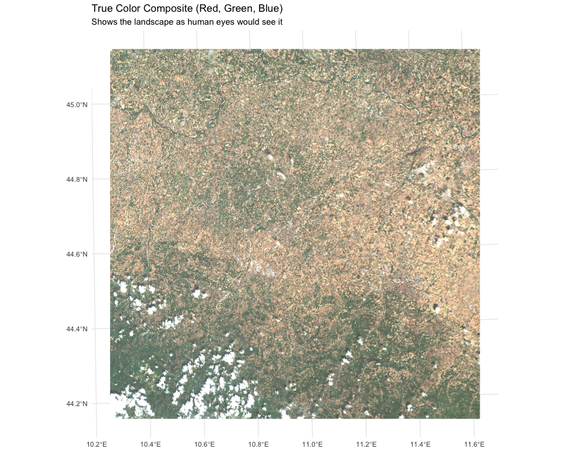
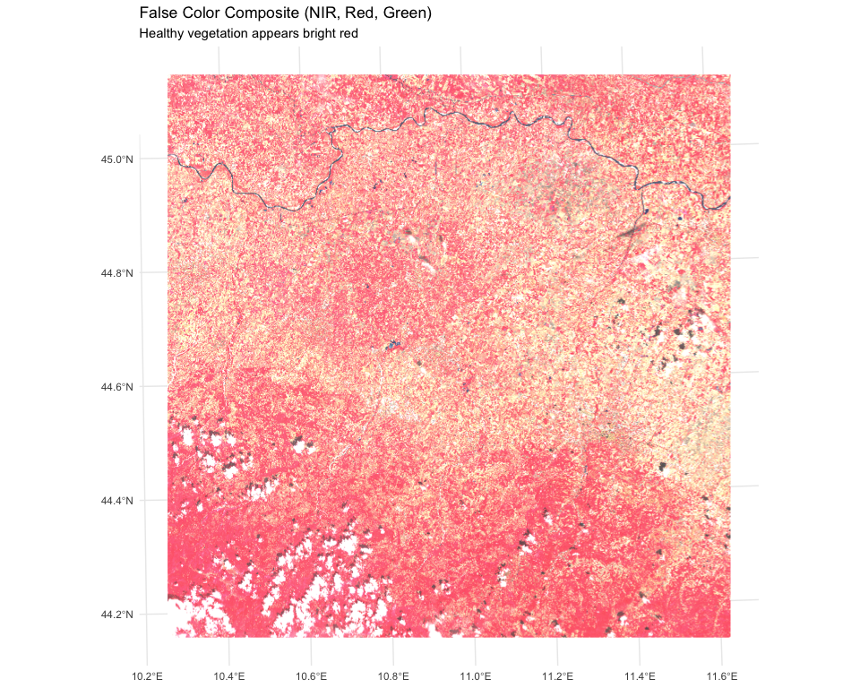
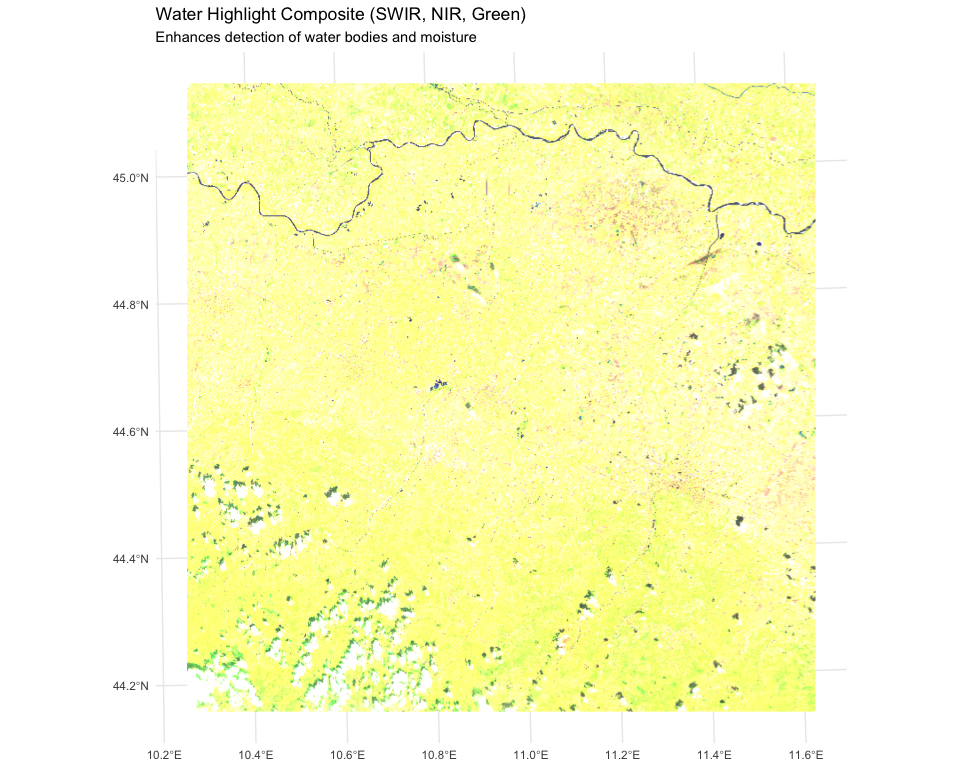

Exploring tidyterra Functions
================
Iris Nana Obeng
20th August, 2025

# Introduction

This analysis demonstrates some basic functions from the **tidyterra**
package to process and visualise raster data from Sentinel-2 imagery.
We’ll create various spectral composites and calculate vegetation
indices to analyze land cover features.

## Objectives

- Load and preprocess Sentinel-2 bands
- Create true color, false color, and water highlight composites  
- Calculate and visualize NDVI (Normalized Difference Vegetation Index)

## 1. Loading tidyterra and dependencies

These are the main R packages used for spatial raster data and plotting.

``` r
library(tidyterra)    # For spatial data visualization with ggplot2
library(terra)        # For spatial raster data manipulation
library(ggplot2)      # For creating plots
library(viridis)      # For colorblind-friendly color scales
```

## 2. Data Loading and Preparation

Define paths to Sentinel-2 imagery files.

``` r
safe_dir <- "S2B_MSIL2A_20220811T100559_N0400_R022_T32TPQ_20220811T162101.SAFE"

red_path   <- file.path(safe_dir, "T32TPQ_20220811T100559_B04_10m.jp2")    # Red band
green_path <- file.path(safe_dir, "T32TPQ_20220811T100559_B03_10m.jp2")    # Green band
blue_path  <- file.path(safe_dir, "T32TPQ_20220811T100559_B02_10m.jp2")    # Blue band
nir_path   <- file.path(safe_dir, "T32TPQ_20220811T100559_B08_10m.jp2")    # Near-Infrared band
swir_path  <- file.path(safe_dir, "T32TPQ_20220811T100559_B11_20m.jp2")    # SWIR band

# Load individual raster bands
red   <- rast(red_path)
green <- rast(green_path)
blue  <- rast(blue_path)
nir   <- rast(nir_path)
swir  <- rast(swir_path)
```

## 3. Creating Spectral Composites

We create three different composite images to highlight various
features:

``` r
# Resample SWIR to match the 10m resolution of other bands
swir_resampled <- resample(swir, red)
```

    ## |---------|---------|---------|---------|=========================================                                          

``` r
# Create raster stacks
rgb_true  <- c(red, green, blue)
rgb_veg   <- c(nir, red, green)
rgb_water <- c(swir_resampled, nir, green)

# Set maximum value for visualization
maxv <- 3000
```

## 4. Calculating NDVI

The Normalized Difference Vegetation Index helps identify healthy
vegetation:

``` r
# NDVI formula: (NIR - Red) / (NIR + Red)
ndvi <- (nir - red) / (nir + red)
```

    ## |---------|---------|---------|---------|=========================================                                          |---------|---------|---------|---------|=========================================                                          |---------|---------|---------|---------|=========================================                                          

``` r
ndvi_ds <- terra::aggregate(ndvi, fact = 10)
```

    ## |---------|---------|---------|---------|=========================================                                          

## 5. Visualization

### 5.1 True Color Composite (Natural Colors)

``` r
p_true <- ggplot() +
  geom_spatraster_rgb(data = rgb_true, r = 1, g = 2, b = 3, max_col_value = maxv) +
  coord_sf() +  
  ggtitle("True Color Composite (Red, Green, Blue)",
          subtitle = "Shows the landscape as human eyes would see it") +
  theme_minimal()

print(p_true)
```

<!-- -->

### 5.2 False Color Composite (Vegetation Emphasis)

``` r
p_veg <- ggplot() +
  geom_spatraster_rgb(data = rgb_veg, r = 1, g = 2, b = 3, 
                      max_col_value = maxv) +
  coord_sf() +
  ggtitle("False Color Composite (NIR, Red, Green)",
          subtitle = "Healthy vegetation appears bright red") +
  theme_minimal()

print(p_veg)
```

<!-- -->

### 5.3 Water Highlight Composite

``` r
p_water <- ggplot() +
  geom_spatraster_rgb(data = rgb_water, r = 1, g = 2, b = 3, 
                      max_col_value = maxv) +
  coord_sf() +
  ggtitle("Water Highlight Composite (SWIR, NIR, Green)",
          subtitle = "Enhances detection of water bodies and moisture") +
  theme_minimal()

print(p_water)
```

<!-- -->

### 5.4 NDVI Map

``` r
p_ndvi <- ggplot() +
  geom_spatraster(data = ndvi_ds) +
  scale_fill_viridis_c(option = "viridis", na.value = "transparent",
                       name = "NDVI Value") +
  coord_sf() + 
  ggtitle("Normalized Difference Vegetation Index (NDVI)",
          subtitle = "Higher values indicate healthier, denser vegetation") +
  theme_minimal()

print(p_ndvi)
```

<!-- -->

## 6. Interpretation of Results

**True Color Composite:** Shows the landscape in natural colors, useful
for general feature identification.

**False Color Composite:** Highlights vegetation in bright red tones,
making it easy to identify vegetated areas.

**Water Highlight Composite:** Uses SWIR band to enhance water features
and soil moisture content.

**NDVI Map:** Values range from -1 to 1, where: - Values near 1 indicate
dense, healthy vegetation - Values near 0 indicate bare soil or urban
areas  
- Negative values typically indicate water bodies

## 7. Conclusion

The tidyterra package provides an elegant ggplot2-based interface for
working with spatial raster data. This analysis demonstrates how to
effectively visualize Sentinel-2 imagery for environmental monitoring
and land cover analysis.
