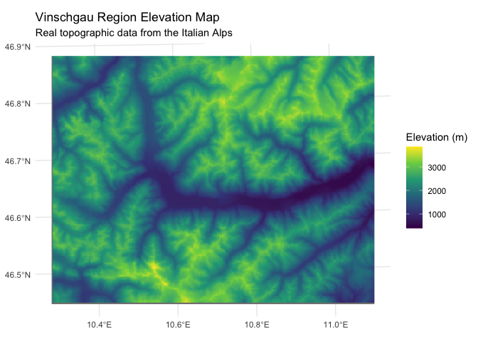
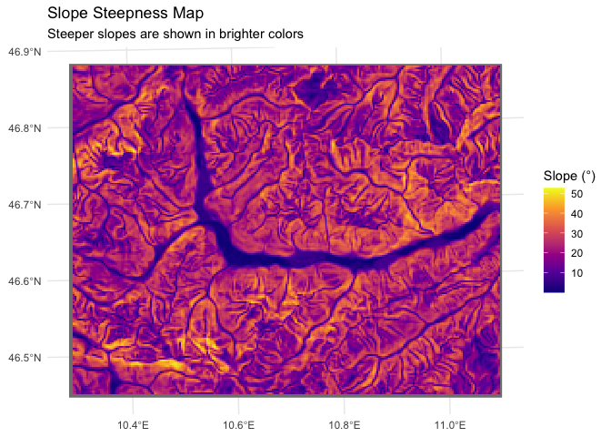
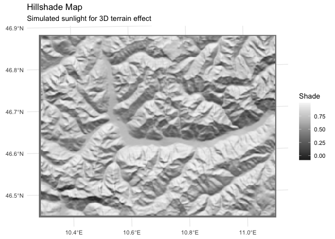
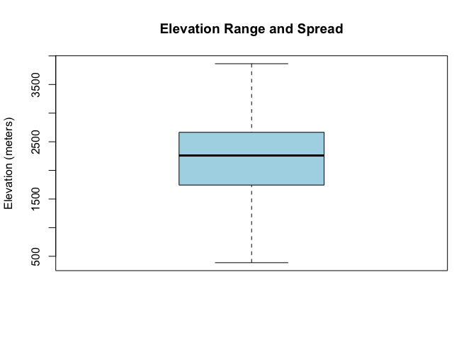

Exploring tidyterra Functions - Learning Journey
================
Iris Nana Obeng
26th August,2025

# Analysis of Vinschgau Elevation Data with tidyterra

This document explores real elevation data from the Vinschgau region
using tidyterra functions.

## 1. Setup and Basic Concepts

``` r
library(tidyterra)  # For spatial visualization with ggplot2
library(terra)      # For working with spatial raster data
library(ggplot2)    # For creating plots
library(viridis)    # Colorblind-friendly color scales
```

## 2. Loading and Understanding the Data

``` r
# Loading real elevation data from Vinschgau region (Italian Alps)
elevation <- rast(system.file("ex/elev_vinschgau.tif", package = "terra"))

# Setting coordinate system for proper mapping
crs(elevation) <- "+proj=utm +zone=32 +datum=WGS84 +units=m +no_defs"

# Displaying and examining the dataset specifications
print("Vinschgau Elevation Data:")
```

    ## [1] "Vinschgau Elevation Data:"

``` r
print(elevation)
```

    ## class       : SpatRaster 
    ## size        : 194, 252, 1  (nrow, ncol, nlyr)
    ## resolution  : 250, 250  (x, y)
    ## extent      : 598250, 661250, 5144500, 5193000  (xmin, xmax, ymin, ymax)
    ## coord. ref. : +proj=utm +zone=32 +datum=WGS84 +units=m +no_defs 
    ## source      : elev_vinschgau.tif 
    ## name        : elev_vinschgau 
    ## min value   :            388 
    ## max value   :           3863

``` r
print(paste("Area size:", round(xmax(elevation)-xmin(elevation), 1), "km ×", 
            round(ymax(elevation)-ymin(elevation), 1), "km"))
```

    ## [1] "Area size: 63000 km × 48500 km"

``` r
print(paste("Elevation range:", round(min(values(elevation), na.rm = TRUE)), "to",
            round(max(values(elevation), na.rm = TRUE)), "meters"))
```

    ## [1] "Elevation range: 388 to 3863 meters"

### Understanding Coordinate Reference System (CRS)

The line
`crs(elevation) <- "+proj=utm +zone=32 +datum=WGS84 +units=m +no_defs"`
tells R exactly where this data is located on Earth:

- `+proj=utm`: Uses Universal Transverse Mercator system (flat grid)
- `+zone=32`: Zone 32 covers parts of Europe including the Alps
- `+datum=WGS84`: Uses standard GPS coordinates
- `+units=m`: All measurements are in meters
- `+no_defs`: No additional transformations needed

## 3. Basic Map Visualization

``` r
ggplot() +
  geom_spatraster(data = elevation) +
  scale_fill_viridis_c(option = "viridis", name = "Elevation (m)") +
  ggtitle("Vinschgau Region Elevation Map",
          subtitle = "Real topographic data from the Italian Alps") +
  theme_minimal()
```

<!-- -->

``` r
ggsave("vinschgau_elevation_map.png", width = 10, height = 8, dpi = 300, bg = "white")
```

### What This Map Shows

This visualization displays elevation using a color gradient: - Darker
colors = Lower elevations (valleys) - Brighter colors = Higher
elevations (mountain peaks) - The “viridis” color scheme mimics how
elevation appears on physical maps

## 4. Terrain Analysis

### Slope Map

``` r
# Calculate how steep the terrain is
slope <- terrain(elevation, "slope", unit = "degrees")

ggplot() +
  geom_spatraster(data = slope) +
  scale_fill_viridis_c(option = "plasma", name = "Slope (°)") +
  ggtitle("Slope Steepness Map",
          subtitle = "Steeper slopes are shown in brighter colors") +
  theme_minimal()
```

<!-- -->

``` r
ggsave("vinschgau_slope_map.png", width = 10, height = 8, dpi = 300, bg = "white")
```

### Understanding Slope

Slope measures how steep the terrain is: - **0°**: Completely flat
land - **10°**: Gentle slope (easy walking) - **30°**: Moderate slope
(challenging hike) - **45°+**: Very steep slope (difficult climbing)

### Hillshade Map

``` r
# Create 3D-like shading effect
slope_rad <- terrain(elevation, "slope", unit = "radians")
aspect_rad <- terrain(elevation, "aspect", unit = "radians")
hillshade <- shade(slope_rad, aspect_rad)

ggplot() +
  geom_spatraster(data = hillshade) +
  scale_fill_distiller(palette = "Greys", name = "Shade") +
  ggtitle("Hillshade Map",
          subtitle = "Simulated sunlight for 3D terrain effect") +
  theme_minimal()
```

<!-- -->

``` r
ggsave("vinschgau_hillshade_map.png", width = 10, height = 8, dpi = 300, bg = "white")
```

### Hillshade Creation Process:

- **`slope_rad`**: Terrain steepness (radians)  
- **`aspect_rad`**: Slope direction (radians)
- **`hillshade`**: Simulated sunlight/shadow effect
- **Result**: 3D-style terrain visualization

### Understanding Hillshade

Hillshade simulates sunlight across the landscape: - **Bright areas**:
Facing the simulated sun - **Dark areas**: In shadow - Creates a 3D
effect that helps visualize terrain shape

## 5. Understanding the Elevation Data

### Elevation Statistics

``` r
# Get elevation values 
elev_values <- values(elevation)[,1]
elev_values <- elev_values[!is.na(elev_values)]

print("Elevation Statistics:")
```

    ## [1] "Elevation Statistics:"

``` r
print(summary(elev_values))
```

    ##    Min. 1st Qu.  Median    Mean 3rd Qu.    Max. 
    ##     388    1744    2260    2179    2665    3863

``` r
print(paste("Number of data points:", length(elev_values)))
```

    ## [1] "Number of data points: 48443"

### Elevation Distribution

``` r
# Simple histogram showing elevation frequencies
hist(elev_values, breaks = 30, col = "steelblue",
     main = "Elevation Distribution in Vinschgau Region", 
     xlab = "Elevation (meters)", ylab = "Frequency")
```

<!-- -->

``` r
png("vinschgau_elevation_histogram.png", width = 1000, height = 800, res = 100)
hist(elev_values, breaks = 30, col = "steelblue",
     main = "Elevation Distribution in Vinschgau Region", 
     xlab = "Elevation (meters)", ylab = "Frequency")
dev.off()
```

    ## quartz 
    ##      2

### Elevation Spread

``` r
# Boxplot showing elevation range
boxplot(elev_values, col = "lightblue", 
        main = "Elevation Range and Spread",
        ylab = "Elevation (meters)")
```

<!-- -->

``` r
png("vinschgau_elevation_boxplot.png", width = 800, height = 1000, res = 100)
boxplot(elev_values, col = "lightblue", 
        main = "Elevation Range and Spread",
        ylab = "Elevation (meters)")
dev.off()
```

    ## quartz 
    ##      2

### Understanding the Statistics

The Vinschgau region has elevations from 388 to 3863 meters:

- 388 meters: Lowest point (valley floors)
- 3863 meters: Highest point (mountain peak)
- 2179 meters: Average elevation
- This range confirms we’re working with alpine mountain terrain

## 6. Outcome

### About the Data

- The Vinschgau region has dramatic elevation changes (over 2500m
  difference!)
- This is characteristic of the Italian Alps mountain range
- The data includes both valleys and high mountain peaks

### About tidyterra

- `geom_spatraster()` makes beautiful maps from spatial data
- `terrain()` function can derive useful information and calculate slope
  from elevation
- `shade()` function creates realistic 3D effects
- tidyterra works seamlessly with ggplot2
- Multiple visualization types help understand different aspects of the
  landscape

### About Spatial Analysis

- Coordinate systems are essential for accurate mapping
- Elevation data can be analyzed to understand slope, aspect, and
  terrain
- Different visualizations reveal different patterns in the data

## 7. Conclusion

This exploration demonstrated how to work with real elevation data using
tidyterra. The analysis revealed that the Vinschgau region contains
significant mountainous terrain typical of the Alps, with elevations
ranging from valley floors around 500 meters to mountain peaks over 3000
meters.

These foundational skills in spatial data visualization and terrain
analysis provide a strong basis for working with more complex geospatial
data, including satellite imagery and environmental datasets.

------------------------------------------------------------------------
